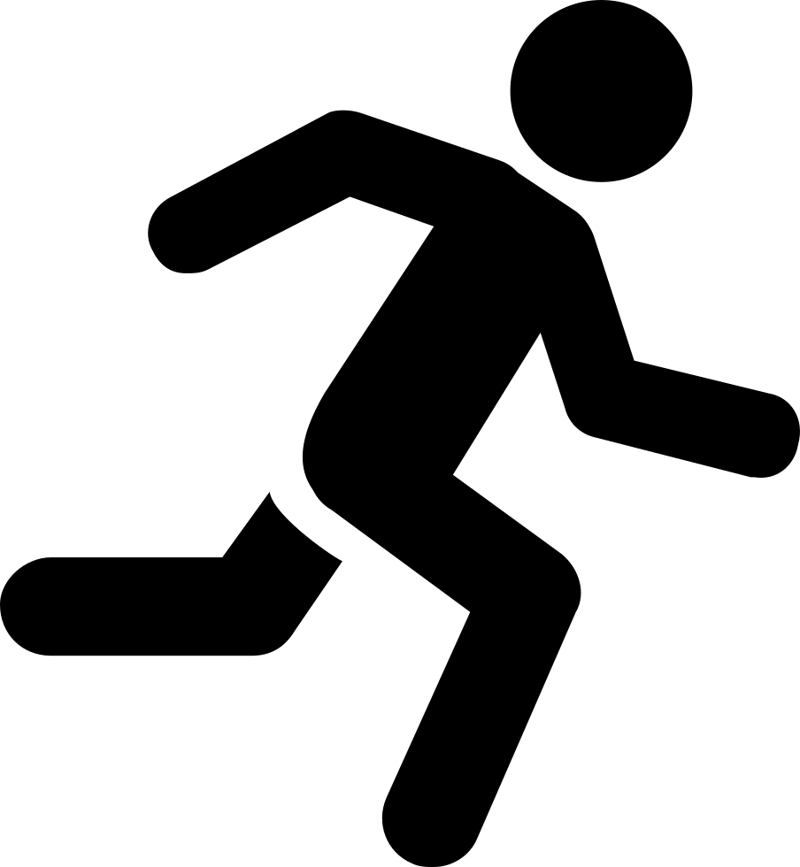

This website is designed to promote a newly opened state of the art gym in cardiff. The gym also specialises in P.T (Personal trainers} who can be privatley hired, with there contact number displayed.

The website is made up of the following pages:
 1. Home
 2. Gallery	
 3. Trainers
 4. Sign Up

 The objectives of this website are :
- To advertise the newly opened gym
- Show a gallery of the gym and pictures of the facilities
- Advertise the pricing
- Reveal contact details of personal trainers
- Easy flowing website with contact details and location

What the audience will be looking for:
Clear information on pricing & location
informative website with clear links 
Easy contact information 
easily joinable

## Strategy:
Fit4ever target audience:

- Male and Female
- Age 13+
- Interested in getting Fit
- Interested in working as a personal trainer
- Interested in hiring a personal trainer
- Interested in joining a gym
- Interested in joining fitness classes
- Anyone who wants to maintain there fitness levels

What these users would be looking for:

- Easy site with appealing information
- Informative website with visible reviews
- Clear contact methods
- Easily sign up / request call back

## Structure:

This is a multi page website with the following pages:

1. Home
2. Gallery	
3. Trainers
4. Sign Up

On each page the social media links are included in the nav bar with the current page highlighted so user can easily identify which page they are on.The navigation links also highlight and underline when you hover over for easy use to know which page you will be navigating to next.

By having multiple pages allows for good structure/flow , allows audience to freely move accross pages with organised sections knowing which page contains certaon information.

## Scope:

In order to get the correct info and business ideas across , the website will contain these features
- Header/logo in top left of nav bar
- menu/nav bar to easily navigate accross pages with nav links being highlighted on hover
- Picture carousel/slideshow on homepage with next/prev arrows
- Gallery of images on seperate page
- Review section
- Testimonial section
- Contact & email us buttons which open up a new tab
- Links to social media in nav bar
- Map with opening times section
- Footer including Quick links to easily navigate to all pages
- Video on trainers page to make page more appealing and to catch users attention
- Sign up form for user to get a call back to complete sign up 
- Same colour scheme / design throughout page.

## Surface:

The colour scheme for my website is a contrast between grey , white & black , after trying a few different themes i decided this option looked the most appealing with the section headers/titles in a black text box with white writing . Each section of the page should have a single line border above/below to  show users clearly its a seperate section.
The fonts picked are from Google fonts, with symbols used throughout page abtained from font-awesome.

The layout used for the site should be consistent throughout keeping same style/design & colour.

## Features:

This is a fully responsive website with the following pages :
1. Home
2. Gallery	
3. Trainers
4. Sign Up

The font on each page in consistent and the same , i used the same fonts which were between 
- Font Roboto
- Font Anton
- Font exo

## Nav Bar:
The nav bar is full width accross the page which when it collapses into smaller viewing screeen eg tablet & phone device it collapses into a tab button which once clicked opens the nav.
The Nav bar highlights which page your currently on and highlights and underlines when user hovers above the other page links. The nav bar sits above the carousel and is in the same posiition throghout the page.
The nav bar has site logo on top left with social media links on top right , which have been keptin the same colour scheme which also hover too.

## Footer:
The footer is consistent with the nav bar using the same colour scheme with quick links which can be used to navigate to other site pages, the footer has similar hover effect.

# Home page contents:

### Carousel:
The home page consists of a 4 image carousel which auto starts but also includes next/previous arrows with tabs at bottom to easily naviagte through the slides.

### Information box:

- Our Prices - Showing clear prices for certsin groups & available discounts shown
- Why us     - Showing points why users should choose us
- Member Perks- Showing member perks 

## Your Safety Matters 

Showing 4 safety logos across page with a description
- DISABLED ACCESS WITH RAMPS AND LIFT
- 24/7 CCTV
- TRAINED FIRST AIDER ON PREMISES
- REGULARLY CLEANED AND SANITISED

## Our Facilities
Few pictures showing what failities available at the gym

## Reviews
Review section showing users reviews from previous satisfied customers.

## Where to find us
Map section which zooms in and out with address specified

## Contact us 
Conatins 2 buttons which have a hover effect which once clicked open up in new tab 
- Email us
- Call us

## Opening times
Clearly show opening hours with certain days.

# Trainers Page contents

## Video
page contains a clear video which jatches in with the scheme and helps users engage with the site more

## Info box
Why Choose Personal Trainers?
- Contains information / benefits to why the user should consider having a personal trainer

Benefits of a Personal Trainers?
- Contains points to why the user should have a personal trainer

Your sessions
- Some information about what your sessions will include

### Image 
Image of a personal trainer and his client whilst in a session

## Testimonials
Testimonails section showing users experience from previous satisfied PT customers.

## Meet the trainers
This section inc;udes 6 images of personal trainers in a circle container format , which once hovered over shows the name and phone number which is displayed as a button which you can click and directly call.

# Gallery & Sign up page

## Gallery
Gallery page shows a attractive gallery in the design of hexagons which once hovered over highlights the current image

## Sign up page 
Sign up page consists of a background with a sign up form which once completed the user recieves a call back to complete sign up process which includes payment etc.

# Technologies Used:

[HTML](https://developer.mozilla.org/en-US/docs/Web/HTML)
- Used as the basic building block for the project and to structure the content.

[CSS](https://developer.mozilla.org/en-US/docs/Learn/Getting_started_with_the_web/CSS_basics)
- Used as the basic building block for the project and to structure the content.

[Google Fonts](https://fonts.google.com/)
- Used as the basic building block for the project and to structure the content.

[Font Awesome](https://fontawesome.com/)
- Used as the basic building block for the project and to structure the content.

[GitHub](https://github.com/)
- Used to store code for the project after being pushed.

[Git](https://git-scm.com/)
Used for version control by utilising the Gitpod terminal to commit to Git and Push to GitHub.

[Gitpod](https://www.gitpod.io/)
Used as the development environment.

