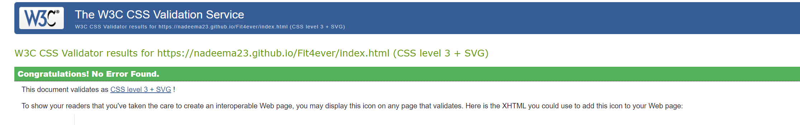

This website is designed to promote a newly opened state of the art gym in cardiff. The gym also specialises in P.T (Personal trainers} who can be privatley hired, with there contact number displayed.

The website is made up of the following pages:
 1. Home
 2. Gallery	
 3. Trainers
 4. Sign Up

 The objectives of this website are :
- To advertise the newly opened gym
- Show a gallery of the gym and pictures of the facilities
- Advertise the pricing
- Reveal contact details of personal trainers
- Easy flowing website with contact details and location

What the audience will be looking for:
Clear information on pricing & location
informative website with clear links 
Easy contact information 
easily joinable

## Strategy:
Fit4ever target audience:

- Male and Female
- Age 13+
- Interested in getting Fit
- Interested in working as a personal trainer
- Interested in hiring a personal trainer
- Interested in joining a gym
- Interested in joining fitness classes
- Anyone who wants to maintain there fitness levels

What these users would be looking for:

- Easy site with appealing information
- Informative website with visible reviews
- Clear contact methods
- Easily sign up / request call back

## Structure:

This is a multi page website with the following pages:

1. Home
2. Gallery	
3. Trainers
4. Sign Up

On each page the social media links are included in the footer with the current page highlighted so user can easily identify which page they are on.The navigation links also highlight and underline when you hover over for easy use to know which page you will be navigating to next.

By having multiple pages allows for good structure/flow , allows audience to freely move accross pages with organised sections knowing which page contains certaon information.

## Scope:

In order to get the correct info and business ideas across , the website will contain these features
- Header/logo in top left of nav bar
- menu/nav bar to easily navigate accross pages with nav links being highlighted on hover
- Picture carousel/slideshow on homepage with next/prev arrows
- Gallery of images on seperate page
- Review section
- Testimonial section
- Contact & email us buttons which open up a new tab
- Links to social media in nav bar
- Map with opening times section
- Footer including Quick links to easily navigate to all pages
- Video on trainers page to make page more appealing and to catch users attention
- Sign up form for user to get a call back to complete sign up 
- Same colour scheme / design throughout page.

## Surface:

The colour scheme for my website is a contrast between grey , white & black , after trying a few different themes i decided this option looked the most appealing with the section headers/titles in a black text box with white writing . Each section of the page should have a single line border above/below to  show users clearly its a seperate section.
The fonts picked are from Google fonts, with symbols used throughout page abtained from font-awesome.

The layout used for the site should be consistent throughout keeping same style/design & colour.

## Skeleton: 

Please note the actual design has changed slightly since these wireframes.
i initially was using Balsamiq to create the wireframes however the application crashed and will not load again causing me to loose the first produced wireframes.I have attempted to install Balsamiq a few times to the same result. 

ive since used an alternative site however with more time i could have produced more detailed wire frames like the first ones.

## Features:

This is a fully responsive website with the following pages :
1. Home
2. Gallery	
3. Trainers
4. Sign Up

The font on each page in consistent and the same , i used the same fonts which were between 
- Font Roboto
- Font Anton
- Font exo

## Nav Bar:
The nav bar is full width accross the page which when it collapses into smaller viewing screeen eg tablet & phone device it collapses into a tab button which once clicked opens the nav.
The Nav bar highlights which page your currently on and highlights and underlines when user hovers above the other page links. The nav bar sits above the carousel and is in the same posiition throghout the page.
The nav bar has site logo on top left with social media links on top right , which have been keptin the same colour scheme which also hover too.

## Footer:
The footer is consistent with the nav bar using the same colour scheme with quick links which can be used to navigate to other site pages, the footer has similar hover effect.The footer contains social links too.

# Home page contents:

### Carousel:
The home page consists of a 4 image carousel which auto starts but also includes next/previous arrows with tabs at bottom to easily naviagte through the slides.

### Information box:

- Our Prices - Showing clear prices for certsin groups & available discounts shown
- Why us     - Showing points why users should choose us
- Member Perks- Showing member perks 

### Your Safety Matters:

Showing 4 safety logos across page with a description
- DISABLED ACCESS WITH RAMPS AND LIFT
- 24/7 CCTV
- TRAINED FIRST AIDER ON PREMISES
- REGULARLY CLEANED AND SANITISED

### Our Facilities:
Few pictures showing what failities available at the gym

### Reviews:
Review section showing users reviews from previous satisfied customers.

### Where to find us:
Map section which zooms in and out with address specified

### Contact us:
Conatins 2 buttons which have a hover effect which once clicked open up in new tab 
- Email us
- Call us

### Opening times:
Clearly show opening hours with certain days.

# Trainers Page contents

### Video:
page contains a clear video which jatches in with the scheme and helps users engage with the site more

### Info box:
Why Choose Personal Trainers?
- Contains information / benefits to why the user should consider having a personal trainer

Benefits of a Personal Trainers?
- Contains points to why the user should have a personal trainer

Your sessions
- Some information about what your sessions will include

### Image:
Image of a personal trainer and his client whilst in a session

### Testimonials:
Testimonails section showing users experience from previous satisfied PT customers.

### Meet the trainers:
This section inc;udes 6 images of personal trainers in a circle container format , which once hovered over shows the name and phone number which is displayed as a button which you can click and directly call.

# Gallery & Sign up page:

## Gallery:
Gallery page shows a attractive gallery in the design of hexagons which once hovered over highlights the current image. Gallery was originally a plain gallery but after speaking to my tutot Guido thought it was better to take it up a level. Researched hexagon gallery and edited it to suit.

## Sign up page: 
Sign up page consists of a background with a sign up form which once completed the user recieves a call back to complete sign up process which includes payment etc.

# Technologies Used:

[HTML](https://developer.mozilla.org/en-US/docs/Web/HTML)
- Used as the basic building block for the project and to structure the content.

[CSS](https://developer.mozilla.org/en-US/docs/Learn/Getting_started_with_the_web/CSS_basics)
- Used as the basic building block for the project and to structure the content.

[Google Fonts](https://fonts.google.com/)
- Used as the basic building block for the project and to structure the content.

[Font Awesome](https://fontawesome.com/)
- Used as the basic building block for the project and to structure the content.

[GitHub](https://github.com/)
- Used to store code for the project after being pushed.

[Git](https://git-scm.com/)
- Used for version control by utilising the Gitpod terminal to commit to Git and Push to GitHub.

[Gitpod](https://www.gitpod.io/)
- Used as the development environment.

[Balsamiq](https://www.figma.com/)
- Used to create the wireframes for the project.

[Pexels](https://www.pexels.com/)
- Access to non-copyright stock images

[W3C CSS Validation Service](https://jigsaw.w3.org/css-validator/#validate_by_input)
- Used to validate all CSS code written and used in this webpage.

[W3C Markup Validation Service](https://validator.w3.org/)
- Used to validate all HTML code written and used in this webpage.

[Image](https://imagecompressor.com/)
- image compressor

[Image](https://imageresizer.com/resize/download/6311408c31380d001296030b)
- image resizer

[Bootstrap](https://getbootstrap.com/)
- Obtained some code and reseacrched and learnt various coding methods

[uizard](https://uizard.io/)
- Replacement application to create wireframes since balsamiq stopped working.

# Testing

## User Stories:

1. As a first-time visitor i want to easily navigate through the page using the nav bar. As seen below you can see the naviagtion bar is easy to use
and it higlights which page your currently on.

2. As a first-time visitori want to easily contact personal trainers.
As seen below the page is designed so you can easily contact the personal trainers by hovering over there image which then shows there name and contact number which you can call directly by clicking the contact number.

3. As a first-time visitor i want to easily complete the sign up form.As shown below the user can easily fill out the form which then redirects you to show form has been completed.

4. As a first-time visitor i want to easily access the information and see opening hours.
As shown below the user can easily find information and opening hours in clear seperate sections.The user can easily find address with a map included or use the call/email buttons if they require more assistance.

## Lighthouse:

Lighthouse is a very good & useful tool found in chrome developor and is used to show the websites 
- Performance
- Accessibility
- Best Practices
- SEO

As shown above initially my site was not too bad overall , which i then improved on to get the best i can.

I made an effort to improve this by reducing image sizes , adding preconnect to certain links , addin meta , improving layout which all led to my scores improving even more!

## HTML and CSS Validation:

I often validated my HTML and CSS code whilst building the website to avoid making the same small errors and to decrease work load at end of project.
Upon running my HTML code now i encountered 1 error shown below, this was easily fixed by changing the incorrect icon type to image/x-icon.

Upon submition site has 0 errors.

## Known bugs and fixes:

As part of my testing I wanted to make sure that all of my clickable social links worked & opened up in a new page, I found that the links opened in the same window. I used the target _blank to open a new window and used the 'rel="noreferrer"' to all external links as this is considered best practice.

I removed the social icons from the top navbar from my tutor advise and also in case it deterred users from the site , instead i moved them into the footer.

I converted most images to .webp to improve load times .

Initially my carousel was too big and after getting feedback from my tutor Guido i put more time into the carousel to get it to the perfect size.This was easily resolved by resizing the images and the carousel. i also converted and compressed the images for faster load times.

As part of my testing i encountered an error on trainers.html which was not appearing for the other pages,after investigating i realised i had used a h1 heading more than once which was bugging the site.This was easily resolved by changing the h1 to h2.

Throughout the entire process, I used Google Dev Tools to debug the website and its layout, this allowed me to check the responsiveness of the site and quickly debug any issues that I came across.

## Deployment:
1. Log in to GitHub
2. In your Repository section, select the project repository that you want to deploy
3. In the menu located at the top of this section, click 'Settings'
4. Select 'Pages' on the left-hand menu - this is around halfway down
5. In the source section, select branch 'Master' and save
6. The page is then given a site URL which you will see above the source section, it will look like the following:

Please note it can take a while for this link to become fully active.

### Forking the GitHub Repository

If you want to make changes to your repository without affecting it, you can make a copy of it by 'Forking' it. This ensures your original repository remains unchanged.

1. Find the relevant GitHub repository
2. In the top right corner of the page, click the Fork button (under your account)
3. Your repository has now been 'Forked' and you have a copy to work on

### Cloning the GitHub Repository

Cloning your repository will allow you to download a local version of the repository to be worked on. Cloning can also be a great way to backup your work.

1. Find the relevant GitHub repository
2. Press the arrow on the Code button
3. Copy the link that is shown in the drop-down
4. Now open Gitpod & select the directory location where you would like the clone created
5. In the terminal type 'git clone' & then paste the link you copied in GitHub
6. Press enter and your local clone will be created.

## Credits:

Throughout this website i have used numerous sources for where ive got my information :

[Pexels](https://www.pexels.com/)
- Access to non-copyright stock images

[Youtube](https://www.youtube.com/)
- Obtained video 

[Freepik](https://www.freepik.com/free-photo/young-fitness-man-studio_8990574.htm#query=4k%20gym&position=0&from_view=search)
- Access to non-copyright stock images

[Shutterstock](https://www.shutterstock.com/)
- Access to non-copyright stock images

[Bootstrap](https://getbootstrap.com/)
- Obtained some code and reseacrched and learnt various coding methods

## Acknowledgements:
I would like to thank my course mentor Guido Cecilio for his support and guidance throughout the course of the project.

